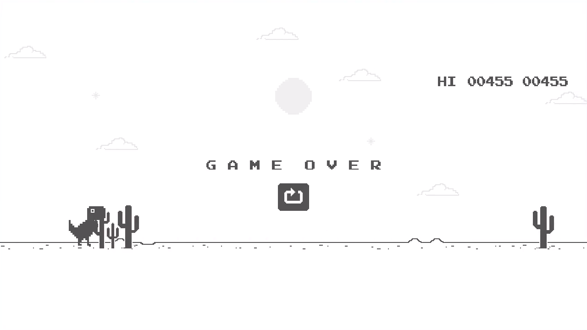

# chrome-dino
Google Chrome Dinosaur Game, but made with C++ and SFML
> Similar to <chrome://dino>, only Google Chrome!

---

 

---

## Dependencies
+ C++ compiler: [g++](https://gcc.gnu.org/) or [clang++](https://clang.llvm.org/)
+ [SFML](https://www.sfml-dev.org/)

---

## Compile and run

Compile:
```bash
git clone https://github.com/terroo/chrome-dino
cd chrome-dino
g++ main.cpp -lsfml-graphics -lsfml-window -lsfml-system
```

Run:
```bash
./a.out
```
---

> The step by step was shown in the video: <https://youtu.be/SEImvXJ88sE>


